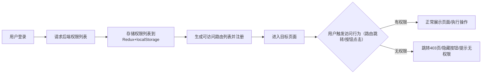

# 个人管理知识库前端技术文档

## 1. 技术栈选型

基于 React、Vite、Ant Design 搭建个人管理知识库前端项目，以下是覆盖数据获取、路由、移动端适配、部署运维等核心场景的完整技术栈选型，符合行业最佳实践：

|技术分类|选型技术|选型原因|
|---|---|---|
|核心框架|React 19|最新稳定版，引入 Actions、Server Components 支持，组件化与并发模式适配复杂 UI 开发|
|构建工具|Vite 7 (Rolldown)|基于 Rolldown 核心，提供极速的热更新与构建速度，原生支持 ES 模块，适配现代前端开发流程|
|UI组件库|Ant Design 6 + Ant Design Mobile|PC 端用 Ant Design 6 满足后台管理需求，移动端用 Ant Design Mobile 适配，提供更灵活的主题定制与组件性能|
|路由管理|React Router v7|集成 Remix 核心功能，支持嵌套路由、路由守卫与智能数据加载，API 设计更简洁、类型安全|
|数据获取|Axios + TanStack Query v5|Axios 处理 HTTP 请求；TanStack Query 优化异步数据管理（缓存、自动刷新、状态同步），大幅减少重复编码|
|状态管理|Redux Toolkit + React Context|Redux Toolkit 简化 Redux 使用；Context 管理局部状态；配合 **Redux Persist** 实现状态持久化（如登录态、主题偏好）|
|样式处理|Less + Tailwind CSS + PostCSS|Less 满足 Antd 主题定制；Tailwind CSS 3.4+ 快速实现响应式布局；PostCSS 处理样式兼容性（自动前缀、pxtorem）|
|数据可视化|Ant Design Charts 2.6|基于 G2Plot 封装，提供丰富的图表类型（折线、柱状、饼图等），适配后台数据统计分析场景|
|图标系统|Ant Design Icons 6.0|官方图标库，深度集成 Ant Design 组件，支持语义化图标与自定义扩展|
|类型校验|TypeScript 5.x|强类型约束，提升代码可维护性与协作效率，配合现代 IDE 提供卓越的开发体验|
|移动端适配|amflexible + PostCSS pxtorem|实现 rem 自适应布局，保证在不同尺寸手机终端上的视觉一致性|
|代码规范|ESLint 9 + Prettier 3|ESLint 9 采用新版 Flat Config 配置，Prettier 统一格式，Husky 拦截 Git 提交保证代码规范落地|
|测试工具|Vitest + React Testing Library|与 Vite 生态深度兼容，低成本实现单元测试与组件测试，提升代码可靠性|
|部署运维|Docker + Nginx + GitHub Actions|Docker 容器化部署保障环境一致性，Nginx 负责反向代理与静态资源托管，Actions 实现 CI/CD 自动化流程|
|其他辅助|lodash、dayjs、js-cookie|覆盖通用工具函数、时间处理、Cookie 管理等业务场景，减少重复造轮子|
## 2. 项目架构模式


先创建空白文件目录，基础组件的都可以先编写

```Plain Text
src/
├── config/           # 全局配置层（统一管理配置，避免硬编码）
│   ├── env/          # 环境配置（区分开发/测试/生产）
│   │   ├── development.ts  # 开发环境（接口地址、日志级别等）
│   │   ├── test.ts         # 测试环境
│   │   └── production.ts   # 生产环境
│   ├── theme/        # 主题配置（Ant Design主题变量、多主题预设）
│   │   ├── light.less      # 浅色主题变量
│   │   ├── dark.less       # 深色主题变量
│   │   └── themeConfig.ts  # 主题切换/持久化配置
│   ├── permission/   # 权限配置（路由权限标识、按钮权限常量）
│   │   ├── routePermissions.ts  # 路由-权限映射表
│   │   └── buttonPermissions.ts # 按钮-权限映射表
│   └── app.ts        # 应用通用配置（如分页默认值、文件大小限制）
├── assets/
│   ├── images/
│   ├── icons/ 
│   ├── styles/
│   └── media/
├── components/       # 通用UI层（按复用范围+业务域拆分）
│   ├── common/       # 全局通用组件（跨所有业务，无业务耦合）
│   │   ├── Button/
│   │   ├── Input/
│   │   ├── Modal/
│   │   └── Empty/
│   ├── business/
│   │   ├── video/
│   │   ├── document/
│   │   ├── point/
│   │   └── permission/
│   └── layout/   # 布局组件（按终端+业务场景拆分）
│       ├── pc/   # PC端布局
│       │   ├── AdminLayout.tsx  # 后台管理布局（侧边栏+顶部导航）
│       │   ├── FrontLayout.tsx  # 前台展示布局（头部+主体+页脚）
│       │   └── AuthLayout.tsx   # 登录/注册布局
│       └── mobile/        # 移动端布局
│           ├── AdminLayout.tsx  # 后台移动端布局（折叠导航）
│           ├── FrontLayout.tsx  # 前台移动端布局（底部导航）
│           └── AuthLayout.tsx   # 登录/注册移动端布局
├── hooks/
│   ├── common/
│   ├── front/        # 前台业务hooks
│   │   ├── useVideoPlayer.ts   # 视频播放器逻辑（倍速、清晰度、积分扣减）
│   │   ├── useDocumentRender.ts # 文档渲染逻辑（Markdown/富文本、目录生成）
│   │   └── useSearch.ts         # 搜索逻辑（联想、筛选、空结果处理）
│   └── admin/        # 后台业务hooks
│       ├── useTable.ts          # 后台表格逻辑（分页、筛选、批量操作）
│       ├── useDict.ts           # 字典渲染逻辑（下拉框绑定、缓存）
│       └── usePointRule.ts      # 积分规则逻辑（获取/消费规则配置）
├── api/
│   ├── interceptors/ # 请求/响应拦截器（Token、加载状态、错误处理）
│   │   ├── requestInterceptor.ts  # 请求拦截（添加Token、参数格式化）
│   │   └── responseInterceptor.ts # 响应拦截（状态码处理、数据格式化）
│   ├── front/        # 前台接口（首页/视频/文档/个人中心）
│   │   ├── homeApi.ts       # 首页接口
│   │   ├── videoApi.ts      # 视频接口（播放、点赞、积分扣减）
│   │   ├── documentApi.ts   # 文档接口（预览、下载、收藏）
│   │   └── profileApi.ts    # 个人中心接口
│   ├── admin/ # 后台接口（控制台/系统/视频/字典/人员/积分/内容）
│   │   ├── dashboardApi.ts  # 控制台接口
│   │   ├── systemApi.ts     # 系统模块接口
│   │   ├── videoApi.ts      # 视频管理接口
│   │   ├── dictApi.ts       # 字典管理接口
│   │   ├── userApi.ts       # 人员管理接口
│   │   ├── pointApi.ts      # 积分管理接口
│   │   └── contentApi.ts    # 内容管理接口
│   └── auth/         # 登录/注册接口
├── store/            # 状态管理层（按状态域拆分，分层管理）
│   ├── slices/       # 状态切片（全局状态，避免单一store臃肿）
│   │   ├── userSlice.ts     # 用户状态（信息、权限、登录态）
│   │   ├── themeSlice.ts    # 主题状态（亮色/暗黑、自定义配置）
│   │   ├── permissionSlice.ts # 权限状态（路由/按钮权限列表）
│   │   └── pointSlice.ts    # 积分状态（余额、变动通知）
│   └── hooks.ts      # 状态操作Hook（简化useDispatch/useSelector）
├── utils/            # 工具函数层（通用工具，无业务耦合）
│   ├── request.ts    # 请求工具（Axios封装，对接interceptors）
│   ├── format.ts     # 格式化工具（时间、数字、字符串）
│   ├── storage.ts    # 存储工具（Cookie/LocalStorage/Redux持久化）
│   ├── permission.ts # 权限工具（权限校验、路由过滤）
│   └── media.ts      # 媒体工具（视频格式转换、图片压缩）
├── router/           # 路由配置层（按业务+权限拆分）
│   ├── index.tsx      # 路由入口（注册静态/动态路由）
│   ├── routes.tsx     # 路由规则（按业务拆分：前台/后台/公开）
│   ├── guard.tsx      # 路由守卫（权限校验、登录态检查）
│   └── helper.tsx     # 路由辅助工具（跳转、参数解析）
├── types/            # 类型定义层（统一管理，提升类型安全）
│   ├── common.ts     # 通用类型（分页、响应体、通用枚举）
│   ├── front.ts      # 前台业务类型（视频、文档、搜索）
│   ├── admin.ts      # 后台业务类型（控制台、系统、视频、字典等）
│   └── auth.ts       # 登录/注册类型
├── pages/
│   ├── auth/
│   ├── front/
│   │   ├── home/
│   │   ├── video/
│   │   ├── document/
│   │   ├── search/
│   │   └── profile/
│   └── admin/
│       ├── dashboard/
│       ├── system/
│       ├── video/
│       ├── dictionary/
│       ├── user/
│       ├── point/
│       └── content/
├── App.tsx           # 根组件（整合布局与路由）
├── main.tsx          # 入口文件（初始化React、注入状态、挂载根组件）
└── vite-env.d.ts     # Vite环境类型声明
```

### 2.1 架构核心原则与实施要求

1. **分层解耦原则**：严格遵循“UI层（pages/components）→ 逻辑层（hooks）→ 数据层（api/store）”的分层调用规则，层间通过明确的接口通信，禁止跨层依赖（如UI层直接调用api，需通过hooks或store中转），降低层间耦合度；

2. **模块化拆分原则**：按“业务域”拆分模块（如auth、admin、front），模块内部实现高内聚（相关功能集中存放），模块之间通过公共组件、hooks、接口实现低耦合交互，避免模块间直接引用；

3. **最大化复用原则**：公共逻辑（如权限校验、请求处理）抽离为自定义Hooks/工具函数，公共UI（如按钮、表单）封装为通用组件，减少重复编码，提升开发效率与代码一致性；

4. **可扩展原则**：预留多维度扩展入口——主题配置支持自定义扩展、权限系统支持角色/权限点动态添加、接口请求支持拦截器扩展、路由支持动态注册，适配后续功能迭代与业务拓展；

5. **可维护原则**：统一目录结构、命名规范（如组件采用PascalCase、工具函数采用camelCase）、类型定义，新增功能按现有架构规则接入，降低团队协作成本与后期维护难度；

6. **模块通信原则**：模块间通信需遵循“数据自上而下、事件自下而上”的单向数据流——全局数据通过store共享，局部数据通过Props传递，子组件向父组件通信通过回调函数，跨层级组件通信优先使用Context或store，避免Prop Drilling。

### 2.2 API对接后端

#### 核心目录规范

- 目录路径：`src/api/` 为前端对接后端 API 的**唯一统一入口**，所有后端接口请求均需在此目录下编写和管理，禁止在业务组件内直接编写原生请求代码。
- 目录核心职责：按业务模块封装 API 请求方法，集中处理请求拦截、响应拦截、错误处理、环境配置等逻辑，保证接口调用的一致性、可维护性和可复用性。

#### API 封装与拦截处理

| 处理类型     | 处理文件 / 位置         | 核心处理逻辑                                                 |
| ------------ | ----------------------- | ------------------------------------------------------------ |
| **请求封装** | 各业务模块 API 文件     | 1. 基于项目底层请求库（如 Axios）封装语义化 API 函数（如`getUserInfo()`、`submitOrder()`）；2. 每个函数明确参数、返回值类型，补充注释说明接口用途；3. 支持单独配置接口超时、请求头等（覆盖全局配置）。 |
| **请求拦截** | `src/api/interceptors/` | 1. 自动添加全局通用请求头（如 Token、设备标识、接口版本号）；2. 请求参数格式化（空值过滤、数据类型转换）；3. 触发全局加载状态（如顶部加载条）。 |
| **响应拦截** | `src/api/interceptors/` | 1. 统一格式化响应数据（提取业务层有效数据，剥离通用响应壳）；2. 全局状态码处理（如 401 未登录跳转登录页、403 权限不足提示、500 服务器错误统一上报）；3. 终止全局加载状态。 |
| **错误处理** | 拦截器 + API 层统一捕获 | 1. 分类处理异常（网络错误、超时错误、业务错误），返回标准化错误信息；2. 关键错误自动上报日志系统，非关键错误给出友好提示；3. 避免在业务组件中重复编写错误处理逻辑。 |

1. `src/api/` 是前端对接后端 API 的唯一统一入口，需按业务模块拆分文件，禁止组件内直写请求；
2. 统一处理请求 / 响应拦截、错误捕获、环境配置，减少重复代码，提升接口维护性；
3. API 函数需语义化命名、补充完整注释，关键参数前置校验，支持单独配置超时 / 请求头。

## 3. 路由与权限设计方案

### 3.1 路由设计（基于React Router v6）

#### 3.1.1 路由分类

|路由类型|适用场景|示例|
|---|---|---|
|公开路由|无需登录即可访问（面向游客）|`/`（首页）、`/login`（登录）、`/register`（注册）|
|登录后路由|需登录认证，无角色限制（面向所有已登录用户）|`/profile`（个人中心）、`/collection`（我的收藏）|
|权限路由|需登录且具备指定角色权限（面向特定角色用户）|`/admin/*`（后台管理所有页面）|
#### 3.1.2 路由实现方式

- 静态路由：定义基础路由（公开路由、404路由、500路由），统一维护在`router/routes.ts`，直接注册无需动态校验；

- 动态路由：后台返回当前用户可访问的权限路由列表，用户登录后通过接口获取，动态注册到路由系统；

- 嵌套路由：适配后台布局（侧边栏+内容区）、前台详情页（头部+主体+评论区）等场景，如`/admin/dashboard`嵌套在`/admin`布局路由下，提升布局复用性。

### 3.2 权限设计

#### 3.2.1 权限维度

1. **路由权限**：
   - 前端预定义路由权限标识（如`admin:dashboard`），登录后请求后端权限列表，对比过滤生成用户可访问路由；

    - 路由守卫（`Router Guard`）拦截未授权访问：未登录用户访问需登录路由时跳转登录页，已登录用户访问无权限路由时跳转403页；

    - 权限存储：Redux存储当前权限列表（内存级存储，实时响应），localStorage持久化存储（避免页面刷新丢失）。

2. **按钮级权限**：
   - 封装通用权限组件`AuthButton`，接收`permission`属性（权限标识），根据当前用户权限列表决定是否渲染按钮；

    - 示例：`<AuthButton permission="video:edit">编辑视频</AuthButton>`，若用户无`video:edit`权限则不渲染该按钮。

3. **数据权限**：
   - 前端请求数据时携带用户角色/ID等身份信息，后端根据身份信息过滤返回对应权限范围内的数据；

    - 前端仅做展示层控制（如隐藏无权限数据入口），核心数据权限由后端校验，保障数据安全。

#### 3.2.2 权限校验流程



#### 3.2.3 生成测试管理员账号

账号：admin

密码：123456

## 4. 主题系统设计方案

基于Ant Design的主题定制能力，实现多主题切换与多终端适配，兼顾用户个性化需求与体验一致性：

### 4.1 系统主题设定

**核心入口**

- 功能触发：通过「系统设置」按钮唤起配置面板，支持实时预览配置效果并保存生效。

**系统外观设置**

| 功能名称           | 功能描述                                               | 可选配置                                                     |
| ------------------ | ------------------------------------------------------ | ------------------------------------------------------------ |
| **基础主题切换**   | 预设两套核心主题，适配不同使用场景，降低视觉疲劳       | 浅色主题（默认）：适配大多数办公 / 日间使用场景；深色主题：适配夜间 / 低光环境使用 |
| **自定义主题配置** | 支持用户个性化调整界面风格，适配不同审美和使用需求     | 1. 主色调：蓝色 / 绿色 / 紫色 / 自定义色值；2. 字体大小：常规 / 放大 / 缩小；3. 间距：紧凑 / 常规 / 宽松 |
| **自适应主题**     | 根据设备类型自动优化界面细节，保证跨设备使用体验一致性 | 自动适配 PC / 手机 / 平板：PC 端间距放大、布局宽松；移动端间距紧凑、优化触控交互 |

**布局自定义设置**

| 功能名称       | 功能描述                                     | 可选配置                             |
| -------------- | -------------------------------------------- | ------------------------------------ |
| 侧边栏展开状态 | 控制左侧导航栏的显示 / 折叠模式              | 展开 / 收起 / 自动折叠（滚动时收起） |
| 顶部加载条显示 | 页面跳转 / 接口请求时显示顶部进度条          | 显示 / 隐藏                          |
| 系统 Logo 显示 | 控制顶部导航栏左侧 Logo 的显示状态           | 显示 / 隐藏                          |
| 导航按钮显示   | 控制顶部导航栏核心操作按钮（如刷新、退出）   | 显示 / 隐藏                          |
| 面包屑导航显示 | 显示当前页面的层级路径，支持快速返回上级页面 | 显示 / 隐藏                          |
| 标签页常显设置 | 控制打开的页面标签是否常驻（不自动关闭）     | 常显 / 默认（超出数量自动关闭）      |
| 底部信息显示   | 控制页面底部版权、版本号等信息的显示状态     | 显示 / 隐藏                          |

**页面功能设置**

| 功能名称     | 功能描述                                   | 可选配置                            |
| ------------ | ------------------------------------------ | ----------------------------------- |
| 导航过渡效果 | 页面切换时添加动画过渡，提升交互体验       | 开启 / 关闭（支持多种过渡动画选择） |
| 文字选中功能 | 允许用户选中页面内文字进行复制、分享等操作 | 允许 / 禁止                         |

### 4.2 实现方案

1. **主题变量管理**：
       

    - 在`styles/variables.less`中统一定义Ant Design主题变量（如`@primary-color`、`@background-color`、`@font-size-base`）；

    - 按主题类型拆分变量文件（如`styles/light.less`、`styles/dark.less`），切换主题时动态加载对应变量文件覆盖默认值。

2. **主题切换逻辑**：


    - 封装`ThemeContext`上下文组件，管理主题状态（当前主题类型、自定义配置），结合Redux存储全局主题配置；
    
    - 自定义Hook`useTheme`：提供主题切换方法（`switchTheme`）、主题配置获取方法（`getThemeConfig`），供业务组件调用；
    
    - 主题持久化：localStorage存储用户主题偏好配置，页面初始化时读取配置并应用，保证主题状态不丢失。

3. **移动端主题适配**：
       

    - 深色主题下优化移动端文字对比度（提升至4.5:1以上，符合WCAG标准），避免低光环境下视觉模糊；

    - 自定义主题时限制移动端可配置项（如禁止过大字体、过宽间距），保证移动端布局完整性与触控体验。

### 4.3 主题切换流程

```mermaid

flowchart LR
        A[用户点击主题切换按钮/修改配置] --> B[调用useTheme.switchTheme方法]
        B --> C[更新Redux中全局主题状态]
        C --> D[动态加载对应主题变量文件，覆盖默认样式]
304→
305→## 5. 未来扩展建议
306→
307→### 5.1 内容处理增强
308→
309→- **Markdown 引擎升级**：目前使用正则解析 Markdown，建议后续迁移至 `react-markdown` 或 `marked`，配合 `rehype-highlight` 实现更精准的代码高亮与复杂的 Markdown 语法支持（如数学公式、甘特图）。
310→- **富文本编辑器**：若需支持更复杂的文档编辑，可考虑集成 `Tiptap` 或 `Bytemd`（字节跳动开源，适配 React 且内置 Markdown 支持）。
311→
312→### 5.2 质量保障与监控
313→
314→- **端到端测试 (E2E)**：引入 `Playwright` 或 `Cypress`，针对核心业务流（如登录、视频播放积分扣减）编写自动化测试用例，降低回归测试成本。
315→- **性能监控**：集成 `Web Vitals` 监控核心性能指标（LCP、FID、CLS），并在生产环境配置错误收集工具（如 Sentry），实时捕获运行时异常。
316→
317→### 5.3 架构演进
318→
319→- **微前端架构**：若后续管理后台与前台展示逻辑进一步复杂，可考虑基于 `wujie` 或 `module federation` 进行微前端拆分，提升大型团队协作效率。
320→- **多语言支持 (i18n)**：目前已有 `LanguageContext` 基础，后续可引入 `react-i18next` 实现更完整的国际化多语言方案。
        D --> E[将主题配置持久化到localStorage]
        E --> F[页面样式实时更新，应用新主题]
    
```
## 5. 模块功能详细设计

前台界面->登录界面->后台管理，所有UI使用Ant Design 5 + Ant Design Mobile

### 5.1 前台展示页面设计（front）

#### 5.1.1 首页（home）

**核心定位**：

面向游客与已登录用户的入口页面，展示核心内容与功能入口，兼顾美观与实用性：

**头部导航区**：

| 终端   | 功能说明                                                     | UI / 交互规范                                                |
| ------ | ------------------------------------------------------------ | ------------------------------------------------------------ |
| PC 端  | 1. 核心入口：Logo（点击返回首页）、核心导航菜单（视频 / 知识栏，hover 显示下拉分类）；2. 搜索功能：支持文档 / 视频关键词搜索，实时联想提示（匹配标题 / 标签）；3. 用户操作：头像下拉框（含后台管理、个人信息、登录 / 登出）；4. 视觉切换：主题切换按钮（亮色 / 暗色模式）。 | 1. 常驻顶端，初始状态与 Banner 区对齐；2. 滚动触发条件：滑轮滚动过完整 Banner 区域后，导航栏左右收缩（宽度与下方内容区齐平），添加毛玻璃效果（背景模糊 + 半透明），固定悬浮；3. 交互反馈：导航菜单 hover 高亮，搜索框聚焦时边框变色，下拉框展开有过渡动画。 |
| 移动端 | 1. 导航折叠：汉堡按钮（点击展开核心菜单弹窗）；2. 搜索优先：搜索框置顶（占满屏幕宽度，简化输入路径）；3. 关键操作：登录 / 注册按钮、主题切换按钮（放大尺寸，优先展示）。 | 1. 导航栏高度适配触控（≥44px）；2. 汉堡按钮点击后弹出侧滑菜单（从左向右），带遮罩层；3. 搜索框输入区放大（字体≥16px），联想提示适配屏幕宽度，避免溢出。 |

**主体内容区**：

| 模块        | 功能说明                                                     | UI / 交互规范                                                |
| ----------- | ------------------------------------------------------------ | ------------------------------------------------------------ |
| Banner 区域 | 1. 内容展示：首页欢迎语、核心功能介绍（打字机特效动态呈现）；2. 核心引导：放大版搜索框（提示文案 “搜索文档 / 视频”），引导用户主动搜索；3. 视觉背景：固定背景图（低饱和度，避免干扰前景内容）。 | 1. 视觉层次：背景图 + 毛玻璃叠加层，前景内容（文字 / 搜索框）居中对齐；2. 动效规范：打字机特效速度适中（150ms / 字），搜索框聚焦时有放大过渡（1.02 倍）；3. 适配要求：PC 端 Banner 高度≥500px，移动端自适应屏幕高度（占满首屏 60%）。 |
| 分类导航    | 1. 功能：知识库 / 视频分类快捷入口（按一级分类展示）；2. 跳转：点击卡片直接跳转对应分类列表页。 | 1. 布局：PC 端横向滚动（超出部分显示滚动条），移动端横向轮播（带指示器）；2. 卡片设计：圆角矩形（半径 8px），带分类图标 + 分类名称 + 内容数量（例：Java 知识库・200 + 文档），hover / 点击时有阴影加深效果；3. 数量控制：最多展示 8 个核心分类，其余通过 “更多分类” 按钮跳转全部分类页。 |
| 推荐内容    | 1. 内容逻辑：已登录用户展示「个性化推荐」（基于收藏 / 浏览 / 搜索行为），游客展示「热门内容」（按近 30 天热度排序）；2. 排序：默认按热度（点赞 + 收藏 + 浏览量加权）降序排列。 | 1. 布局：PC 端瀑布流（2-3 列），移动端单列流式布局；2. 卡片信息：缩略图 + 标题（最多 2 行，超出省略）+ 作者 + 点赞 / 收藏数 + 更新时间；3. 交互：卡片 hover 上浮（阴影 + 轻微缩放），点击跳转详情页，支持快速收藏（未登录弹窗引导登录）。 |
| 最新更新    | 1. 内容范围：最近 7 天上传的文档 / 视频；2. 信息展示：标题 + 更新时间（精确到日）+ 作者 + 内容类型标签（文档 / 视频）。 | 1. 布局：PC 端 / 移动端均为列表布局（左图右文）；2. 视觉标识：更新时间标红，内容类型标签用不同颜色区分（文档 - 蓝色，视频 - 橙色）；3. 交互：点击列表项跳转详情页，支持侧滑显示 “收藏 / 分享” 功能（移动端）。 |

**侧边栏**：

| 终端   | 功能说明                                                     | UI / 交互规范                                                |
| ------ | ------------------------------------------------------------ | ------------------------------------------------------------ |
| PC 端  | 1. 权限控制：- 未登录：显示 “登录 / 注册” 按钮（突出展示）；- 已登录：个人中心快捷入口（我的收藏、我的上传）+ 浏览历史；2. 通用功能：热门标签（按使用频率排序）、推荐分类（与分类导航互补）。 | 1. 布局：固定在页面右侧（宽度 280px），随页面滚动；2. 样式：热门标签用圆角标签云（点击可关闭 / 跳转），推荐分类用列表 + 图标；3. 交互：点击入口直接跳转对应页面，标签 hover 变色，浏览历史支持 “清空”（已登录）。 |
| 移动端 | 1. 触发方式：底部导航栏 “我的” 按钮触发；2. 内容：与 PC 端侧边栏一致（权限控制逻辑相同）。 | 1. 布局：底部弹窗（占满屏幕宽度，高度≥60%），带半透明遮罩；2. 交互：弹窗从下向上滑入，支持下拉关闭，按钮尺寸≥48px（便于触控）。 |

**页脚**：

| 功能分类 | 具体内容                                                     | UI / 交互规范                                                |
| -------- | ------------------------------------------------------------ | ------------------------------------------------------------ |
| 基础链接 | 关于我们、联系方式、隐私政策、用户协议、反馈入口（表单 / 弹窗） | 1. 布局：PC 端横向排列（分栏），移动端纵向排列（换行）；2. 样式：文字颜色浅于正文，hover 下划线高亮；3. 交互：反馈入口点击弹出表单（必填项：问题描述 + 联系方式）。 |
| 站点数据 | 本站运行时间（精确到天）、累计访问人数、累计访问次数         | 1. 样式：用图标 + 数字展示（例：📅 运行 1280 天），数字加粗；2. 更新频率：实时更新（访问次数）/ 每日更新（运行时间）。 |

##### 响应式适配原则

1. **断点定义**：
   - 移动端：≤768px（单列布局，底部弹窗替代侧边栏）；
   - 平板端：769px-1024px（双列瀑布流，侧边栏缩小为 240px）；
   - PC 端：≥1025px（三列瀑布流，完整侧边栏）。
2. **触控友好**：移动端按钮 / 可点击区域尺寸≥48px，间距≥16px（避免误触）。
3. **内容适配**：图片 / 卡片自适应屏幕宽度（禁止横向滚动），文字大小随屏幕尺寸缩放（移动端最小字体≥14px）。
4. **性能优化**：瀑布流图片懒加载，移动端隐藏非核心动画（如毛玻璃效果简化）。

##### 补充说明（提升落地性）

1. **权限控制总览**：
   - 未登录用户：仅展示公共内容（热门 / 推荐 / 最新），核心入口限制（收藏 / 上传 / 浏览历史不可见）；
   - 已登录用户：全功能开放，个性化推荐 + 个人数据同步。
2. **交互反馈**：
   - 点击反馈：按钮 / 卡片点击时有 “按压” 效果（颜色变深 + 轻微缩放）；
   - 加载反馈：搜索 / 跳转时显示加载动画（骨架屏 / Spinner）；
   - 提示反馈：登录成功 / 收藏成功等操作显示顶部 Toast（3 秒自动消失）。

#### 5.1.2 视频展示页面（video）

**（一）搜索设计**

**搜索入口设计**

| 终端       | 入口位置                                               | 设计要点                                                     | 交互细节                                                     |
| ---------- | ------------------------------------------------------ | ------------------------------------------------------------ | ------------------------------------------------------------ |
| **PC 端**  | 首页导航栏右侧固定位置，与 Logo / 菜单 / 用户入口并列  | 搜索框宽度≥400px，高度 44px，圆角 8px，内置放大镜图标，占位符 "搜索视频 / 文档" | 点击放大镜或按下 Enter 键触发搜索，支持键盘快捷键 Ctrl+F     |
| **移动端** | 首页顶部固定区域（优先于内容），或折叠导航展开后的首位 | 搜索框占满屏幕宽度，高度 56px，左侧放大镜图标，右侧 "语音搜索" 按钮（麦克风图标） | 点击输入框自动聚焦，键盘弹出，语音按钮点击后启动录音识别，识别结果自动填充并搜索 |

**通用优化**：

- 搜索框**自动联想**：输入≥2 字符时，实时显示热门关键词和历史搜索记录，支持上下箭头选择，Enter 键确认
- **历史搜索**：显示最近 5-10 条搜索记录，支持点击快速重新搜索，右侧 "清空历史" 按钮
- **热门搜索**：在搜索框下方或首页专门区域展示 7-10 个高频搜索词，带热度标记（如🔥），点击直接搜索

**搜索结果展示设计**

| 展示维度     | 设计规范                                                     | 终端差异                                                     |
| ------------ | ------------------------------------------------------------ | ------------------------------------------------------------ |
| **布局方式** | 视频卡片 + 关键信息，每行 2-3 个卡片（PC）/ 单列（移动端），瀑布流加载 | PC 端：2-3 列，卡片宽度 300-400px；移动端：单列，卡片宽度 100% |
| **卡片内容** | 封面图 (16:9)+ 标题 (≤2 行)+ 上传者 + 时长 + 播放量 + 评分 (如适用) | 移动端：标题字号 16px，上传者 / 时长 / 播放量字号 12px；PC 端：相应增大 2-4px |
| **封面优化** | 关键帧截图 + 视频时长角标 (如 "01:23")，支持懒加载，鼠标悬停显示预览小窗 | 移动端：封面高度 200px；PC 端：封面高度 240-320px            |
| **交互设计** | 点击卡片跳转视频详情页，鼠标悬停卡片显示播放 / 收藏 / 分享快捷按钮 | 移动端：长按卡片显示操作菜单；PC 端：hover 显示浮动操作面板  |

**搜索结果排序与筛选**：

- **默认排序**：相关性（关键词匹配度）> 热度（播放量 + 点赞数）> 发布时间（最新优先）
- **筛选条件**：
  - 内容类型：全部 / 视频 / 剧集 / 短片 / 直播等
  - 时间范围：最近 1 天 / 7 天 / 30 天 / 全部时间
  - 清晰度：标清 / 高清 / 超清 / 4K
  - 来源：官方 / 用户上传 / 合作平台
  - 评分区间：★★★★★~★☆☆☆☆（如适用）
- **筛选位置**：PC 端在搜索框下方或结果页左侧固定区域；移动端在搜索框下方或下拉筛选菜单

**（二）视频播放器**

| 维度             | 详细规范                                                     |
| ---------------- | ------------------------------------------------------------ |
| 核心功能（通用） | 1. 基础控制：播放 / 暂停（核心按钮，居中展示）、进度条拖拽调节（支持精准定位）、音量滑块控制（静音一键切换）；2. 进阶控制：- 倍速播放：可选 0.5/0.75/1.0（默认）/1.25/1.5/1.75/2.0 倍，下拉菜单展示；- 清晰度切换：标清（480P）/ 高清（720P）/ 超清（1080P），默认「自动」（根据网络带宽实时适配：带宽＜1Mbps 切标清，1-3Mbps 切高清，＞3Mbps 切超清）；3. 播放模式：全屏播放（快捷键 F11）、画中画播放（悬浮窗，支持页面切换后继续播放）。 |
| PC 端 UI / 交互  | 1. 播放器尺寸：默认宽高比 16:9，宽度占父容器 80%（最大 1200px），高度自适应；2. 控件展示：鼠标悬停播放器显示完整控件，无操作 3 秒后自动隐藏（仅保留进度条）；3. 交互反馈：进度条拖拽时有时间预览提示，倍速 / 清晰度切换后有文字 Toast 提示（如 “已切换至 1.5 倍速”），全屏按钮点击有缩放过渡动画。 |
| 移动端 UI / 交互 | 1. 播放器尺寸：占满屏幕宽度，宽高比 16:9，适配各类手机屏幕；2. 触控控制：- 双击播放器任意位置：暂停 / 播放；- 左侧区域上下滑动：调节亮度（0-100%，滑动时显示亮度条）；- 右侧区域上下滑动：调节音量（0-100%，滑动时显示音量条）；- 左右滑动任意区域：调节播放进度（滑动时显示时间差提示，如 “+10s/-10s”）；3. 控件适配：底部控件栏缩小，图标放大（≥32px），便于触控，画中画按钮优先展示。 |
| 异常处理         | 1. 网络异常：播放卡顿 / 加载失败时，显示 “网络不佳，正在重试” 提示，3 次重试失败后提供 “刷新播放” 按钮；2. 格式不支持：播放器显示 “当前视频格式暂不支持播放”，并提示联系客服；3. 权限未解锁：积分未扣除时，播放器显示 “锁定” 图标，无法播放，仅展示视频封面。 |

**（三）视频信息区**

| 维度         | 详细规范                                                     |
| ------------ | ------------------------------------------------------------ |
| 基础信息展示 | 1. 布局（PC 端）：播放器下方，左对齐展示，分行排列：- 第一行：视频标题（加粗，字号≥18px，最多 2 行，超出省略）；- 第二行：简介（字号 14px，最多 3 行，超出显示 “展开” 按钮）；- 第三行：上传者（头像 + 昵称）、发布时间（格式：YYYY-MM-DD）、播放量（数字加粗，如 “1.2 万次播放”）；2. 布局（移动端）：播放器下方，全屏宽度展示，信息纵向压缩，简介默认折叠，点击 “展开” 查看完整内容；3. 视觉：上传者头像圆形（PC 端 40px，移动端 32px），昵称 hover / 点击变色，播放量数字颜色与主色调一致。 |
| 交互优化     | 1. 上传者交互：头像 / 昵称点击跳转个人主页，hover 时显示 “查看 TA 的主页” 提示；2. 点赞 / 收藏：- 按钮样式：图标 + 数字（如👍 128），未点赞 / 收藏为灰色，点击后切换为主色调（如红色 / 蓝色），有轻微缩放动画；- 状态同步：点赞 / 收藏后实时更新数字，取消操作后数字回退，无需刷新页面；3. 分享功能：- 触发：点击 “分享” 按钮弹出弹窗，展示微信（二维码）、QQ（链接）、复制链接三种渠道；- 反馈：复制链接成功后显示 “链接已复制” Toast 提示，弹窗支持点击空白处关闭。 |

**（四）互动区**

1. 评论区

| 维度     | 详细规范                                                     |
| -------- | ------------------------------------------------------------ |
| 功能规范 | 1. 评论发布：- 输入框（PC 端宽度 500px，移动端全屏宽度），支持文字输入，最多 500 字，超出禁止输入；- 发布按钮：未输入内容时置灰不可点击，输入后变为可点击状态，点击后显示 “发布中” 加载动画；2. 评论展示：- 排序：默认按时间倒序排列，顶部提供 “最新”/“热门”（按点赞数排序）筛选按钮；- 内容：每条评论包含用户头像 + 昵称、评论内容、发布时间、点赞数、回复按钮，回复内容嵌套展示（缩进 16px）；3. 交互：- 点赞 / 回复：点击点赞按钮实时切换状态，点击回复按钮弹出子输入框（聚焦状态）；- 加载：评论数＞20 时，分页加载（PC 端每页 20 条，移动端每页 10 条），滚动到底部自动加载下一页；- 空状态：无评论时显示 “快来发表第一条评论吧～”，搭配空状态插图。 |
| 异常处理 | 1. 发布失败：网络异常 / 内容违规时，显示 “评论发布失败，请重试” 提示，保留输入内容；2. 内容违规：输入敏感词时，输入框下方显示 “评论内容包含违规词汇，请修改” 红色提示，发布按钮置灰。 |

2. 相关推荐

| 维度       | 详细规范                                                     |
| ---------- | ------------------------------------------------------------ |
| 内容逻辑   | 1. 推荐规则：优先展示同分类＞同上传者＞用户历史浏览相关的视频，剔除已观看完的视频；2. 数量控制：PC 端默认展示 10 个，移动端默认展示 8 个，支持滑动加载更多。 |
| 布局与交互 | 1. PC 端：评论区右侧，横向排列（卡片式），宽度 280px，每张卡片包含视频封面（带时长角标）+ 标题（1 行省略）+ 播放量；2. 移动端：评论区下方，纵向排列（列表式），全屏宽度，每行包含封面 + 标题 + 播放量，封面占比 1/3；3. 交互：卡片 / 列表项 hover / 点击时，封面轻微放大，标题变色，点击直接跳转对应视频播放页；4. 视觉：视频封面右下角显示时长（如 “05:28”），播放量用 “万 / 千” 单位简化（如 “8.5 万”）。 |

**（五）积分提示（权限控制模块）**

| 维度         | 详细规范                                                     |
| ------------ | ------------------------------------------------------------ |
| 弹窗触发     | 1. 触发时机：用户点击 “播放” 按钮后，优先检测视频是否需积分，需积分则立即弹出弹窗，暂停播放器加载；2. 弹窗样式：- 居中展示（PC 端宽 400px，移动端宽 80%），带半透明遮罩层，圆角 12px；- 内容：标题（“观看需消耗积分”）+ 所需积分（数字加粗，如 “5 积分”）+ 说明（“扣除后不可恢复，是否确认？”）+ 确认 / 取消按钮；- 按钮：确认按钮（主色调，优先展示）、取消按钮（灰色，次要展示），按钮尺寸≥48px（移动端）。 |
| 积分扣除逻辑 | 1. 确认操作：点击 “确认” 后，前端显示 “扣除中” 加载动画，调用后端扣积分接口；- 扣减成功：弹窗关闭，播放器解锁，开始加载播放；- 扣减失败：弹窗显示失败原因（如 “积分不足”“网络异常”），提供 “重新尝试”/“取消” 按钮；2. 取消操作：点击 “取消”/ 关闭弹窗，播放器回到初始状态（仅显示封面），不扣除积分；3. 防重复扣减：添加接口防抖，1 分钟内同一用户同一视频仅触发 1 次扣积分请求。 |
| 异常处理     | 1. 积分不足：弹窗显示 “您的积分不足（当前 XX 积分，需 XX 积分）”，并提供 “去充值” 按钮（跳转积分充值页）；2. 接口超时：显示 “请求超时，请重试”，保留弹窗，用户可点击 “重新尝试” 再次发起请求。 |

#### 5.1.3 文档相关页面（document）

##### 5.1.3.1 文档列表页

| 功能模块 | 详细规范                                                     | 分端适配                                                     |
| -------- | ------------------------------------------------------------ | ------------------------------------------------------------ |
| 筛选功能 | 1. 筛选维度：<br>   - 分类：支持二级分类筛选（如“Java→JVM”“前端→Vue”），多选逻辑；<br>   - 标签：支持多标签组合筛选（如“教程+实战”），标签云展示，点击选中/取消；<br>   - 发布时间：最近1天/7天/30天/90天/全部时间，下拉选择；<br>   - 热度：按浏览量/点赞数/收藏数筛选，单选逻辑；<br>2. 搜索联动：筛选条件与关键词搜索组合生效（关键词输入框在筛选栏顶部，支持实时联想）；<br>3. 筛选状态：已选筛选条件以“标签芯片”形式展示，支持单个删除，顶部提供“重置筛选”按钮。 | 1. PC端：筛选栏固定在页面左侧（宽度240px），筛选条件垂直排列，关键词搜索框在筛选栏顶部；<br>2. 移动端：筛选栏折叠为顶部“筛选”按钮，点击弹出底部筛选弹窗（分维度滚动选择），已选条件在按钮旁显示数量提示（如“筛选(2)”）。 |
| 排序功能 | 1. 排序选项：最新发布（默认）、最热浏览（按近30天浏览量降序）、最高评分（按用户评分≥3星降序）；<br>2. 交互逻辑：排序按钮组在筛选栏右侧（PC端）/搜索框下方（移动端），点击切换排序方式，当前选中项高亮（主色调）；<br>3. 反馈提示：切换排序后显示“已按XX排序”Toast提示（3秒自动消失）。 | 1. PC端：排序按钮水平排列（字号14px），间距16px；<br>2. 移动端：排序按钮横向滚动展示，避免换行，选中项添加底部下划线。 |
| 展示形式 | 1. PC端（卡片式）：<br>   - 布局：2-3列瀑布流，卡片宽度300-360px，高度自适应（最大差异≤100px）；<br>   - 信息层级：封面图（无封面显示默认图标，比例3:1）→ 标题（加粗16px，最多2行省略）→ 简介（14px，最多3行省略）→ 底部信息（上传者头像+昵称+浏览量+标签，字号12px）；<br>2. 移动端（列表式）：<br>   - 布局：单列流式，每行高度100px，左图右文；<br>   - 信息层级：封面图（占比1/3）→ 标题（加粗16px，最多1行省略）→ 核心数据（浏览量+标签，字号12px），简化简介和上传者信息（点击头像可查看）。 | 1. 通用样式：卡片/列表项圆角8px，hover/点击时阴影加深（PC端）/背景变色（移动端）；<br>2. 懒加载：滚动至页面底部1/3时加载下一页（PC端每页20条，移动端每页10条）。 |
| 交互优化 | 1. 基础交互：点击卡片/列表项跳转文档详情页；<br>2. 快捷操作：<br>   - PC端：hover卡片显示“查看详情”按钮（右下角悬浮，主色调背景），支持勾选多个卡片（左上角复选框），顶部显示“批量收藏”按钮（已登录用户）；<br>   - 移动端：长按列表项弹出操作菜单（查看详情/收藏），批量收藏需进入“编辑模式”（顶部勾选按钮）；<br>3. 权限控制：未登录用户点击“收藏”弹窗引导登录，批量收藏最多勾选50条（超出提示“最多选择50条文档”）。 | 1. 批量收藏反馈：收藏成功后显示“已收藏XX条文档”提示，失败（如网络异常）显示“收藏失败，请重试”；<br>2. 移动端触控：可点击区域尺寸≥48px，避免误触。 |

##### 5.1.3.2 文档详情页
| 功能模块 | 详细规范                                                     | 分端适配                                                     |
| -------- | ------------------------------------------------------------ | ------------------------------------------------------------ |
| 内容区   | 1. 渲染规范：<br>   - 支持富文本/Markdown格式（代码块高亮、表格渲染、图片自适应）；<br>   - 代码块：支持语法高亮（Java/JS/HTML等）、复制按钮、换行滚动（避免横向溢出）；<br>   - 图片：懒加载，点击放大查看（弹窗模式，支持左右滑动切换多图）；<br>2. 阅读工具：<br>   - 字号调整：小（14px）/中（16px，默认）/大（18px），下拉菜单选择；<br>   - 模式切换：暗黑模式/亮色模式（记忆用户偏好），切换后实时刷新页面样式；<br>   - 目录导航：基于文档标题（H1-H3）自动生成，支持点击跳转对应章节；<br>3. 排版优化：行间距1.5倍，段落间距24px，正文左对齐，避免文字拥挤。 | 1. PC端：<br>   - 目录固定在右侧（宽度200px），随页面滚动高亮当前章节；<br>   - 内容区宽度800px，居中展示，左右留白；<br>2. 移动端：<br>   - 目录折叠为顶部“目录”按钮，点击弹出侧边弹窗（占满屏幕宽度60%）；<br>   - 内容区宽度100%，左右内边距16px，避免横向滚动；<br>   - 支持滑动翻页：上滑至顶部触发“上一篇”，下滑至底部触发“下一篇”（弹窗提示是否切换）。 |
| 操作区   | 1. 核心按钮：收藏（图标+数字）、分享（支持微信/QQ/复制链接）、点赞（图标+数字）、举报（弹窗提交举报原因）、下载；<br>2. 下载权限控制：<br>   - 免费下载：直接触发下载，显示“下载中，请稍候”提示；<br>   - 积分下载：点击后弹出确认弹窗（标题“下载需消耗XX积分”+ 积分余额提示 + 确认/取消按钮），确认后调用扣积分接口；<br>3. 交互反馈：<br>   - 收藏/点赞：点击后状态实时切换（颜色+数字更新），未登录弹窗引导登录；<br>   - 下载结果：成功显示“下载成功，可在浏览器下载列表查看”，失败（积分不足/网络异常）显示对应提示（积分不足提供“去充值”按钮）。 | 1. PC端：操作区在内容区上方，按钮水平排列（间距16px），图标尺寸24px；<br>2. 移动端：操作区固定在内容区顶部（滚动时悬浮），按钮图标放大（≥32px），分享/举报按钮折叠至“更多”菜单（省略号图标）。 |
| 互动区   | 1. 评论区：<br>   - 发布功能：支持文字输入（最多500字）、代码块插入（语法高亮）、图片上传（单张≤5MB，支持JPG/PNG）；<br>   - 展示逻辑：按时间倒序排列，支持对评论点赞/回复（回复内容嵌套缩进），顶部提供“最新/热门”筛选；<br>   - 空状态：无评论时显示“快来发表你的看法吧～”+ 空状态插图；<br>2. 相关文档推荐：<br>   - 推荐逻辑：同分类＞同标签＞用户浏览历史相关，剔除当前文档；<br>   - 展示形式：PC端右侧列表（与目录并列），移动端内容区下方单列展示（标题+简介+浏览量）。 | 1. PC端：评论区宽度与内容区一致，输入框高度80px；<br>2. 移动端：评论区输入框占满屏幕宽度，高度60px，图片上传按钮固定在输入框右侧。 |

#### 5.1.4 登录后头像页面（个人中心+搜索结果）（profile）

##### 1. 个人中心页面

| 功能模块 | 详细规范                                                     | 分端适配                                                     |
| -------- | ------------------------------------------------------------ | ------------------------------------------------------------ |
| 个人信息 | 1. 展示内容：头像（圆形，PC端80px，移动端60px）、昵称（加粗18px）、手机号（脱敏显示，如138****1234）、邮箱（脱敏显示）、注册时间；<br>2. 编辑功能：<br>   - 触发：点击“编辑信息”按钮（PC端右侧，移动端底部），弹出编辑弹窗；<br>   - 验证逻辑：修改手机号/邮箱需接收验证码，修改昵称/头像需验证登录密码；<br>   - 提交反馈：成功显示“信息修改成功”，失败显示具体原因（如“验证码错误”）；<br>3. 头像上传：支持本地图片上传（≤5MB，正方形裁剪），预览确认后提交。 | 1. PC端：个人信息左图右文（头像+基础信息横向排列），编辑按钮为文字按钮（主色调）；<br>2. 移动端：个人信息纵向排列（头像居中，信息下方对齐），编辑按钮为圆角矩形按钮（主色调背景，占满屏幕宽度80%）。 |
| 我的内容 | 1. 我上传的文档/视频：<br>   - 展示：列表式（PC端2列卡片，移动端单列），包含封面/缩略图、标题、状态（上架/下架）、浏览量、操作按钮（编辑/删除/下架）；<br>   - 操作逻辑：删除需二次确认（弹窗“确定删除该内容？删除后不可恢复”），下架后内容仅自己可见；<br>2. 我的收藏：<br>   - 分类管理：支持创建自定义分类（如“Java学习”“前端实战”），收藏内容可批量移动/取消收藏；<br>   - 展示：按添加时间倒序排列，支持按内容类型（文档/视频）筛选；<br>3. 浏览历史：<br>   - 展示：最近30天浏览记录（最多100条），按浏览时间倒序，每条记录含封面、标题、浏览时间；<br>   - 操作：支持单条删除/一键清空（清空需二次确认）。 | 1. PC端：我的内容标签页横向排列（文档/视频/收藏/历史），点击切换内容区；<br>2. 移动端：我的内容采用顶部选项卡（可横向滚动），操作按钮折叠至“更多”菜单，避免占用空间。 |
| 积分中心 | 1. 核心展示：积分余额（数字加粗，字号24px，主色调）、积分说明（“1积分=1次付费下载”）；<br>2. 积分变动记录：<br>   - 展示：列表式，包含变动类型（获取/消耗）、积分数量、变动原因（如“上传文档奖励”“下载文档消耗”）、变动时间；<br>   - 筛选：支持按时间范围（近7天/30天/全部）筛选；<br>3. 积分兑换：点击“积分兑换”按钮跳转兑换页（可兑换下载次数/会员权益）。 | 1. PC端：积分余额居中展示，变动记录在下方（宽度800px）；<br>2. 移动端：积分余额顶部通栏展示（背景主色调浅色系），变动记录单列排列，左右对齐。 |
| 设置中心 | 1. 主题偏好：亮色/暗黑/跟随系统（记忆用户选择）；<br>2. 消息通知：评论提醒、点赞提醒、收藏提醒（独立开关，默认开启）；<br>3. 账号安全：<br>   - 核心功能：修改密码（需验证原密码）、绑定手机/邮箱（支持更换）、账号注销（需验证身份+二次确认）；<br>   - 安全提示：修改敏感信息后发送短信/邮件通知，账号注销后15天内可恢复。 | 1. PC端：设置项按分类分组（主题/通知/安全），每组之间有分隔线，开关按钮在右侧；<br>2. 移动端：设置项单列排列，高度56px，左右对齐，开关按钮尺寸放大（便于触控）。 |

##### 2. 搜索结果页面
| 功能模块   | 详细规范                                                     | 分端适配                                                     |
| ---------- | ------------------------------------------------------------ | ------------------------------------------------------------ |
| 多条件筛选 | 1. 筛选维度：<br>   - 内容类型：全部（默认）/文档/视频（单选）；<br>   - 发布时间：最近1天/7天/30天/全部（下拉选择）；<br>   - 热度：浏览量≥1000/≥1万/≥10万（多选）；<br>   - 评分：≥3星/≥4星（多选）；<br>2. 交互逻辑：筛选条件与关键词搜索组合生效，已选条件以标签芯片展示，支持单个删除/一键重置；<br>3. 联动效果：切换内容类型后，结果展示形式自动适配（文档卡片/视频卡片）。 | 1. PC端：筛选栏固定在页面左侧（宽度240px），条件垂直排列；<br>2. 移动端：筛选栏折叠为顶部“筛选”按钮，点击弹出底部弹窗（分维度选择），已选条件数量在按钮旁标注。 |
| 结果分类   | 1. 展示逻辑：分“文档结果”“视频结果”两大板块（按内容类型排序，默认优先显示文档），每个板块顶部显示结果数量（如“文档结果（28）”）；<br>2. 关键词高亮：搜索关键词在结果标题中高亮显示（主色调，加粗）；<br>3. 卡片规范：<br>   - 文档卡片：标题+简介+上传者+浏览量+标签；<br>   - 视频卡片：封面图（带时长角标）+ 标题+上传者+播放量+评分。 | 1. PC端：两大板块横向并列（左侧文档，右侧视频），宽度各占50%；<br>2. 移动端：两大板块纵向排列（文档在上，视频在下），每个板块内单列展示，板块之间有分隔线+标题区分。 |
| 空结果处理 | 1. 提示文案：“未找到与‘XX’相关的内容，试试这些建议～”；<br>2. 引导措施：<br>   - 调整搜索词：展示3-5个相关热门关键词（如搜索“Java”无结果，推荐“Java教程”“Java基础”）；<br>   - 热门内容推荐：展示平台TOP10热门文档/视频（按热度排序）；<br>3. 视觉设计：搭配空状态插图（如放大镜+无结果图标），文案居中对齐，推荐内容在下方单列展示。 | 1. PC端：空结果提示区居中（宽度800px），推荐内容2-3列卡片式；<br>2. 移动端：空结果提示区占满屏幕宽度，推荐内容单列列表式，点击关键词直接触发搜索。 |

### 5.2 登录/注册模块（auth）

#### 5.2.1 核心功能

1. 多账号登录：支持用户名/邮箱/手机号 + 密码登录，表单实时校验（格式校验、非空校验），提升登录效率；

2. 验证码登录：支持手机号 + 短信验证码登录，包含验证码倒计时（60s）、验证码格式校验、滑动验证（防机器人攻击）；

3. 辅助功能：

    - 记住密码：Cookie加密存储账号密码，有效期可配置（默认7天），下次登录自动填充；

    - 忘记密码：通过手机号/邮箱验证身份后，跳转密码重置页面（支持设置新密码、确认密码校验）；

    - 第三方登录（可选）：集成微信、GitHub等第三方授权登录，简化登录流程。

4. 注册功能：
        

    - 表单校验：手机号/邮箱唯一性校验（联动后端）、密码强度校验（至少8位，包含字母+数字）、验证码校验；

    - 协议勾选：用户协议、隐私政策必选勾选，点击协议可跳转对应详情页面。

5. 登录态管理：
       

    - 登录成功后，后端生成Token（JWT）返回，前端将Token存储在Cookie（防XSS攻击）+ Redux（实时调用），后续请求自动携带Token；

    - Token过期处理：请求拦截器捕获401状态码，自动跳转登录页并提示“登录已过期，请重新登录”；

    - 退出登录：清除Token、权限列表、用户信息等缓存数据，跳转首页。

#### 5.2.2 交互设计

- 登录/注册表单切换无刷新（单页面内组件切换），提升交互流畅性；

- 表单提交前完成前端校验，减少无效后端请求，校验失败时给出明确提示（如“手机号格式错误”“密码强度不足”）；

- 登录失败时提示具体原因（避免笼统提示“登录失败”），帮助用户快速定位问题；

- 移动端适配：表单宽度自适应屏幕，按钮全屏展示（便于触控），输入框放大字号（提升可读性）。

### 5.3 后台管理系统模块设计（admin）

后台管理系统采用“主模块+子模块”的树形结构设计，以下先完成核心子模块骨架搭建，详情功能后续迭代补充：

#### 5.3.1 控制台（dashboard）

核心功能：数据概览与日常操作入口，实现“一站式管理视图”：

- 数据概览：展示知识库核心数据（文档数、视频数、用户数、积分总额），支持今日/昨日/近7天/自定义时间筛选；

- 数据可视化：使用Ant Design图表组件（折线图展示数据趋势、饼图展示分类占比）；

- 日常操作：最近操作记录（如“10分钟前编辑视频XX”）、待办事项（如待审核视频、待处理工单），点击可直接跳转对应处理页面；

- 交互优化：待办事项标记未读状态，最近操作支持撤销（符合条件的操作）、查看详情。

#### 5.3.2 系统模块（骨架设计）（system）

**核心子模块骨架（系统模块的下拉框内，不同页面）**：

服务器监控、应用监控、日志管理、审计追踪、绑定对接

**详情架构规划详情**：

- 服务器监控

实时状态(CPU、内存、磁盘使用率，秒级更新)
网络流量监控(流入/流出速率、连接数)
服务健康检查(核心服务存活状态、响应时间)
报警阈值设置(超标自动推送通知)

- 应用监控

前端性能监控(FP、FCP、LCP等核心指标)
错误追踪(Sentry集成，捕获JS错误、接口错误)
API调用监控(调用量、成功率、平均响应时间)
用户会话追踪(用户行为路径、页面停留时间)

- 日志管理

日志分级(DEBUG、INFO、ERROR、FATAL)
日志查询与过滤(按时间、模块、级别筛选)
日志分析(高频错误统计、异常趋势)
日志归档(自动归档历史日志，支持导出)

- 审计追踪

敏感操作记录(用户新增/删除、权限变更等)
数据变更追踪(文档/视频内容修改记录)
用户行为分析(活跃用户、核心操作频次)
合规性报告(按监管要求生成操作审计报告)

- 前后端API绑定对接

前端与后端地址绑定

环境差异化配置：开发/测试/生产环境分别配置对应后端API基础地址，通过.env文件统一管理，避免环境混淆
接口前缀统一规范：系统模块所有接口统一前缀为/api/system，通过Axios请求拦截器自动拼接，减少重复编码
动态地址适配机制：支持后端服务地址动态切换，对接配置中心，前端无需重启即可实时更新API访问地址
跨域配置绑定：前端通过Nginx反向代理绑定后端地址，配置CORS跨域规则，保障跨域请求正常通信

访问权限控制

接口级权限绑定：每个API接口关联唯一权限标识（如system:server:monitor），前端请求时携带JWT Token，后端校验权限
Token鉴权流程：登录成功后获取Token并存储，请求拦截器自动在请求头添加Authorization字段，后端解析Token验证身份
白名单访问控制：核心监控接口（如服务健康检查、日志查询）配置IP白名单，仅允许运维服务器或指定IP访问
权限缓存策略：前端缓存用户权限列表，对已授权接口直接放行，未授权接口拦截并跳转403页面

#### 5.3.3 视频管理模块（骨架设计）（video）

**核心子模块骨架（视频管理的下拉框内，不同页面）**：

分类管理、视频上传、视频列表、视频编辑、审核管理

**详情架构规划详情**：

- 视频上传

多格式支持(mp4, mov, avi, mkv等主流格式)
分片上传 + 断点续传(大文件拆分上传，支持暂停/恢复)
实时转码预览(上传后生成预览视频，支持格式转换)
水印添加(支持文字水印/图片水印，可配置位置/透明度)
智能分类(AI标签识别，自动推荐视频分类)

- 视频列表

多维度筛选(按分类、状态、上传时间、播放量筛选)
批量操作(批量删除、批量移动分类、批量修改状态)
视频预览(缩略图展示，支持点击快速预览)
数据统计(单视频播放量、点赞数、收藏数、时长)

- 视频编辑

基础信息编辑(标题、简介、分类、标签)
封面截取/上传(支持从视频中截取关键帧作为封面)
章节标记(支持添加章节节点，跳转播放)
字幕管理(支持上传/编辑字幕，多语言字幕切换)
权限设置(公开/私有/密码访问，支持指定用户可见)

- 分类管理

多级分类树(支持无限层级分类，适配复杂分类场景)
拖拽排序(可视化拖拽调整分类顺序)
分类统计(每个分类下视频数量、播放量统计)

- 审核管理

AI预审核(自动检测违规内容，标记可疑视频)
人工审核队列(按提交时间排序，支持批量审核)
审核日志(记录审核人、审核时间、审核结果)
违规处理(违规视频下架、删除，通知上传者)

优化方案：

- 视频封面自动生成：从视频中智能提取3-5个关键帧，供用户选择；

- 智能标签推荐系统：基于视频内容/标题自动推荐标签，提升分类准确性；

- 视频质量检测：自动检测分辨率、码率，低于标准时提示优化；

- 版权检测功能：对接版权库，检测视频版权归属，避免侵权；

- CDN分发管理：配置视频CDN加速，提升不同地区播放速度。

#### 5.3.4 系统字典管理（骨架设计）（dictionary）

**核心子模块骨架（系统字典的下拉框内，不同页面）**：

字典分类管理、字典项管理、字典使用

**详情架构规划详情**：

- 字典分类管理

系统字典(内置字典，不可修改，如性别、文件类型)
业务字典(自定义字典，如视频分类、积分类型)
Excel导入(支持批量导入字典分类，简化配置)
批量操作(批量启用/禁用、批量删除)
用户自定义字典(支持业务人员自主创建字典)

- 字典项管理

键值对管理(新增/编辑/删除字典项键值)
多语言支持(适配多语言场景，字典项支持多语言文案)
状态控制(启用/禁用字典项，禁用后不参与业务展示)
字典项排序(可视化拖拽调整字典项展示顺序)

- 字典使用

前端组件自动绑定(下拉框、单选框组件直接绑定字典，自动渲染选项)
缓存机制(字典数据本地缓存，减少后端请求)
版本管理(记录字典变更历史，支持回滚到历史版本)


核心功能补充：

- 字典类型管理：增删改查字典类型，区分系统字典与业务字典，保障系统基础配置稳定性；

- 字典项管理：为每个字典类型添加具体字典项，支持排序、启用/禁用，适配业务灵活配置需求；

- 导入导出：支持Excel导入导出字典数据，方便批量维护与备份。

#### 5.3.5 人员管理模块（骨架设计）（user）

**核心子模块骨架（人员管理的下拉框内，不同页面）**：

用户管理、角色权限、部门架构、用户行为

**详情架构规划详情**：

- 用户管理

用户信息管理(基础资料、联系方式、账号状态、注册时间)
角色权限分配(为用户分配对应角色，继承角色权限)
部门/团队管理(关联用户所属部门，支持批量移动)
用户状态管理(激活/禁用账号，禁用后无法登录)
登录日志审计(记录登录时间、登录IP、登录设备)

- 角色权限

RBAC权限模型(基于角色的权限控制，简化权限管理)
权限点粒度控制(支持按钮级、接口级权限配置)
角色继承与组合(支持角色继承，减少重复配置)
权限变更日志(记录角色权限变更历史，便于追溯)

- 部门架构

树形组织结构(可视化展示部门层级，支持无限层级)
部门负责人设置(为每个部门指定负责人，关联管理权限)
部门统计分析(每个部门用户数量、活跃度统计)

- 用户行为

操作日志追踪(记录用户核心操作，如上传/编辑/删除内容)
活跃度分析(按日/周/月统计用户活跃度，识别核心用户)
贡献度统计(统计用户上传文档/视频数量、质量)
异常行为检测(检测异常登录、批量操作等风险行为)

#### 5.3.6 积分管理系统（骨架设计）（point）

**核心子模块骨架（积分管理的下拉框内，不同页面）**：

积分规则、积分流水、积分商城、排行榜

**详情架构规划详情**：

- 积分规则

获取规则(登录奖励、上传文档/视频奖励、评论互动奖励)
消费规则(兑换商品、观看付费视频、下载付费文档)
等级体系(积分关联用户等级，等级提升解锁更多权限)
有效期管理(配置积分有效期，过期自动失效)

- 积分流水

实时流水记录(记录积分增减、操作时间、操作类型)
积分变动统计(按日/周/月统计积分增减趋势)
异常检测(检测异常积分变动，如批量刷积分)
流水导出(支持导出积分流水，用于对账/审计)

- 积分商城

商品管理(虚拟商品：会员时长、下载券；实物商品：周边礼品)
兑换管理(用户兑换申请处理，支持审核/驳回)
库存管理(商品库存监控，库存不足时自动下架)
订单处理(兑换订单管理，记录订单状态、物流信息)

- 排行榜

日/周/月榜(按积分数量排序，展示top用户)
分类排行(按贡献度、活跃度等维度排行)
成就系统(基于排行解锁成就徽章，提升用户粘性)

#### 5.3.7 内容管理（骨架设计）（content）

**核心子模块骨架（内容管理的下拉框内，不同页面）**：

文档管理、编辑器系统、分类标签、统计与分析

**详情架构规划详情**：

- 编辑器系统

双模式编辑: 富文本/Markdown（支持一键切换）
实时保存草稿(每3秒自动保存，避免内容丢失)
版本历史管理(记录编辑历史版本，支持回滚)
代码高亮(支持多种编程语言代码块高亮展示)
图片粘贴/拖拽上传(支持批量上传，自动压缩优化)
文章模板系统(内置多种文档模板，快速创建内容)

- 内容管理

文章状态流: 草稿 → 审核 → 发布 → 下架（完整生命周期）
定时发布功能(设置发布时间，自动上线内容)
SEO优化工具(支持配置标题、关键词、描述，提升搜索排名)
阅读量/点赞统计(实时统计内容曝光数据)
评论管理(审核评论、删除违规评论，支持回复)

- 分类标签

多级分类(支持文档多级分类，适配复杂内容体系)
标签管理(新增/编辑/删除标签，支持批量关联内容)
支持拖拽排序(调整分类/标签展示顺序)
系列文章管理(将相关文档归类为系列，提升阅读连贯性)

- 统计与分析

阅读趋势分析(按时间维度展示内容阅读量变化)
用户行为分析(分析用户阅读偏好、停留时间)
热门文章排行(按阅读量/点赞数/收藏数排序)
SEO效果监控(监控关键词搜索排名、曝光量)

## 6. 部署与运维设计

### 6.1 构建打包

- 开发环境：执行`vite dev`启动开发服务器，支持热模块替换（HMR），实时响应代码修改，开启调试工具（React DevTools、Redux DevTools）便于开发调试；

- 生产环境：执行`vite build`打包生成静态资源，开启代码压缩（JS/CSS/HTML）、Tree Shaking（剔除未使用代码）、资源哈希（避免缓存问题），生成优化后的dist目录；

- 环境区分：通过`.env.development`（开发）、`.env.test`（测试）、`.env.production`（生产）文件区分环境，配置不同的接口地址、日志级别等参数，实现环境隔离。

### 6.2 容器化部署

1. Docker容器化：编写Dockerfile，将打包后的dist静态资源放入Nginx容器，保证部署环境一致性（避免“开发环境正常，生产环境异常”）；

2. Nginx配置：
        

    - 路由重写：配置`try_files $uri $uri/ /index.html`，解决React Router单页应用刷新404问题；

    - 静态资源托管：配置dist目录为静态资源根目录，设置缓存策略（图片、字体等静态资源设置长期缓存）；

    - 反向代理：配置接口请求反向代理，解决跨域问题（如`/api/*`代理到后端接口地址）。

3. CI/CD流程：通过GitHub Actions配置自动化流程，实现“代码提交→自动构建→自动测试→自动推送镜像→服务器拉取镜像运行”，提升部署效率与稳定性。

### 6.3 移动端适配补充

- 布局适配：采用“移动端优先”设计思路，使用`rem`单位（通过amflexible自动计算根字体大小）+ 媒体查询断点（320px、375px、414px、768px），适配不同尺寸设备；

- 组件适配：优先使用Ant Design Mobile组件，适配触摸操作（如按钮尺寸≥44px×44px、表单输入框放大）、手势交互；

- 性能优化：图片懒加载（使用`react-lazyload`）、视频预加载（仅加载首帧），减少移动端流量消耗与加载时间；

- 兼容性测试：在主流手机浏览器（微信内置浏览器、Chrome、Safari）、不同尺寸手机（iPhone、Android）上进行兼容性测试，修复适配问题。

## 7. 总结

1. 技术栈选型覆盖全场景：以React+Vite+Ant Design为核心，补充数据获取（Axios+React Query）、路由管理（React Router v6）、状态管理（Redux Toolkit）等技术，兼顾开发效率、可维护性与多终端适配需求；

2. 架构设计科学合理：采用分层架构+模块化设计，遵循高内聚、低耦合原则，统一目录结构与规范，提升团队协作效率与后期迭代扩展性；

3. 权限体系安全可控：实现路由级、按钮级、数据级三级权限控制，前端展示控制与后端数据校验结合，保障系统安全；

4. 功能设计贴合核心诉求：覆盖“登录/注册-后台管理-前台展示”全流程，后台聚焦管理效率（视频/文档/用户/积分），前台聚焦用户体验（内容浏览/互动），精准匹配个人管理知识库的核心定位；

5. 部署运维标准化：通过Docker容器化、Nginx配置、GitHub Actions CI/CD，实现标准化部署流程，保障系统稳定运行；移动端适配全方位覆盖，保证多终端用户体验一致。